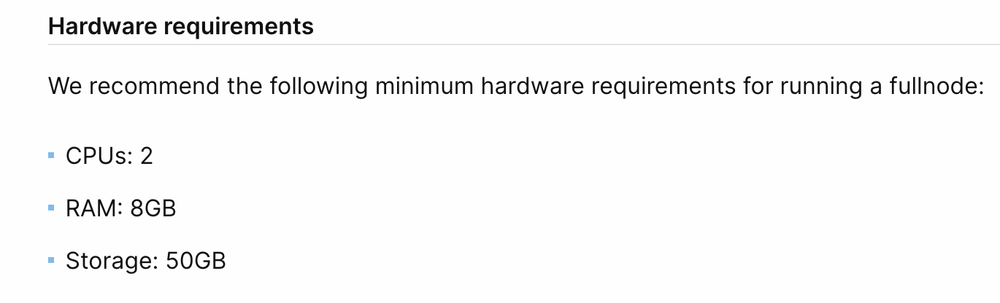

# Sui Node Kurulumu


İlerleyen haftalarda ödüllü Sui Testnet'i başlayacak. Ağa katılım için ön koşul olarak veya önceliklendirme açısından Devnet' e katılım bir kriter olabilir, bundan dolayı sizlerle Devnet node kurulumunu paylaşıyoruz.



Gördüğünüz üzere donanımsal olarak en az 2 çekirdek CPU , 8gb RAM ve 50gb hafıza gerekmektedir


Yazılımsal olarak ise Sui Linux'un Ubuntu dağıtımını tavsiye etmektedir.

Full node kurulumu ve gereksinimler için daha detaylı bilgiye Sui'nin dokümantasyonundan erişebilirsiniz:
https://docs.sui.io/build/fullnode

İlk önce sudoyu kuralım
```
sudo apt install
```
Sonrasında screen'i yükleyelim

```
apt install screen
```

Şimdi de bir screen oluşturalım

```
screen -S sui
```

Artık full node'umuzu yükleyebiliriz

```
wget -O sui.sh https://raw.githubusercontent.com/kj89/testnet_manuals/main/sui/sui.sh && chmod +x sui.sh && ./sui.sh
```

Bu işlem biraz zaman alabilir

Ardından node'umuzun durumunu kontrol etmek için aşağıdaki komutu çalıştırabiliriz

```
service suid status
```

Başarılı olması durumunda buna benzer bir çıktı almanız gerekmektedir


Ardından Devnet'e katılımınızı Sui'nin resmi discord sunucusu üzerinden onaylatmanız gerekmektedir.
Discord' a erişmek için bu linki kullanabilirsiniz: https://discord.com/invite/sui


Discord'da node-ip-applications kanalı üzerinden sunucunuzun ip sini resimde de görebileceğiniz gibi şu formatta paylaşmanız gerekmektedir:
http://ip:9000/

Aşağıdaki hatayı almanız durumunda;

```
Unit suid.service could not be found.
```

Şu komutları sırasıyla çalıştırabilirsiniz:

```
sudo ufw enable
sudo ufw allow 9000
sudo ufw allow 9184
sudo ufw allow 8080
cd sui 
sed -i 's/127.0.0.1/0.0.0.0/' fullnode-template.yaml
docker-compose restart
```
